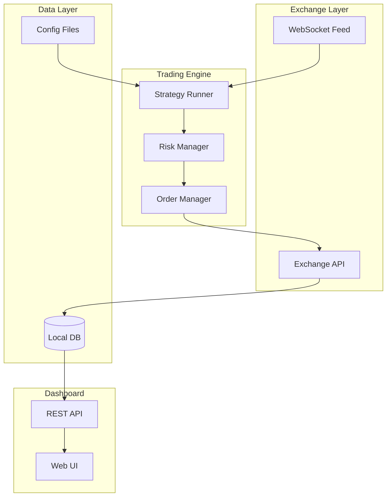

# fricktrader

> **Algorithmic crypto trading bot with real-time dashboard.** Strategy execution, portfolio tracking, and live P&L — automated.


---

## What it does

fricktrader is an algorithmic trading system built for crypto markets. It runs automated trading strategies with a real-time web dashboard for monitoring positions, P&L, and execution history.

Because manually watching charts is a great way to lose money and sleep simultaneously.

---

## Architecture



---

## Features

- **Strategy execution** — Configurable trading strategies with Freqtrade-compatible architecture
- **Real-time dashboard** — Live P&L, open positions, trade history
- **Risk management** — Position sizing, stop-loss, take-profit controls
- **Multi-strategy** — Run and compare multiple strategies simultaneously
- **Local state** — Full trade history stored locally, no third-party dependency

---

## Quick Start

```bash
git clone https://github.com/DaurenNope/fricktrader
cd fricktrader
pip install -r requirements.txt

# Configure your exchange and strategy
cp config/config.example.json config/config.json
# Add your API keys and strategy parameters

# Start the dashboard
python main_dashboard.py

# Or use the start script
bash start.sh
```

Dashboard runs at: http://localhost:8080

---

## Project Structure

```
src/                  # Core trading engine
config/               # Strategy configs and exchange settings
user_data/strategies/ # Trading strategy implementations
scripts/              # Utility and setup scripts
archive/              # Previous strategy versions
main_dashboard.py     # Dashboard entry point
```

---

## Stack

- **Python** — Trading engine and data processing
- **JavaScript/HTML** — Real-time dashboard UI
- **Freqtrade** — Strategy framework compatibility
- **REST API** — Dashboard data layer

---

> ⚠️ This is personal trading software. Use at your own risk. Past performance does not guarantee future results.

---

Built by [@DaurenNope](https://github.com/DaurenNope) · [rahmetlabs.com](https://rahmetlabs.com)
